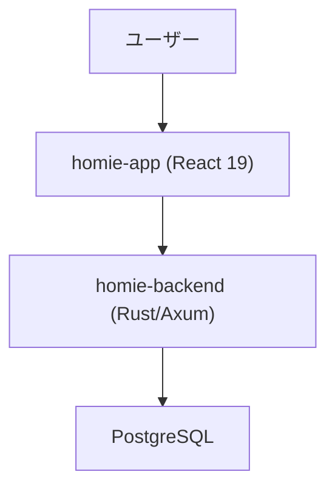
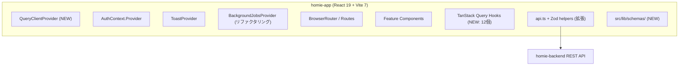
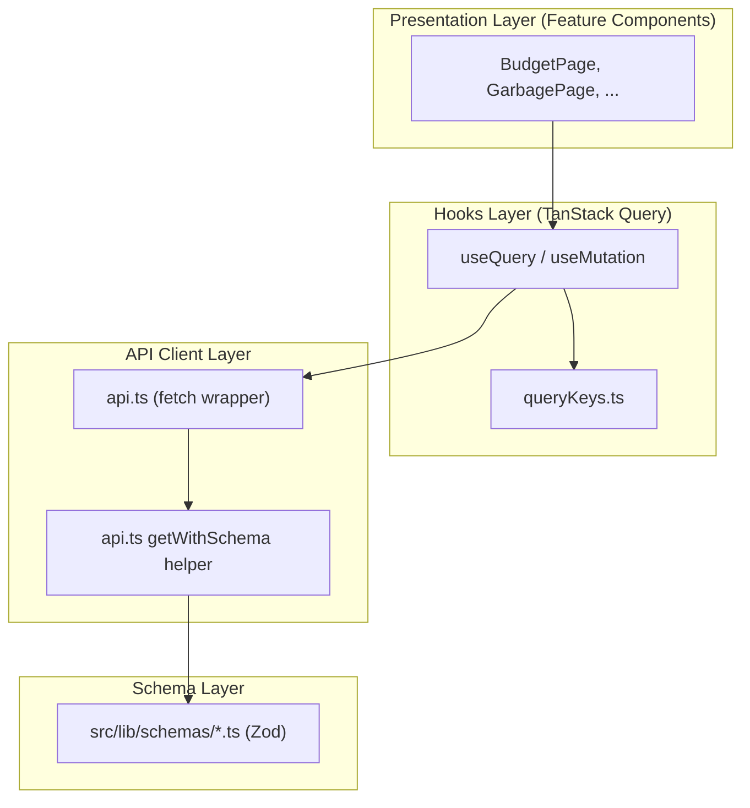
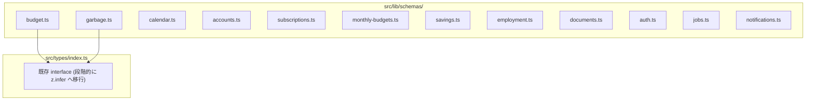
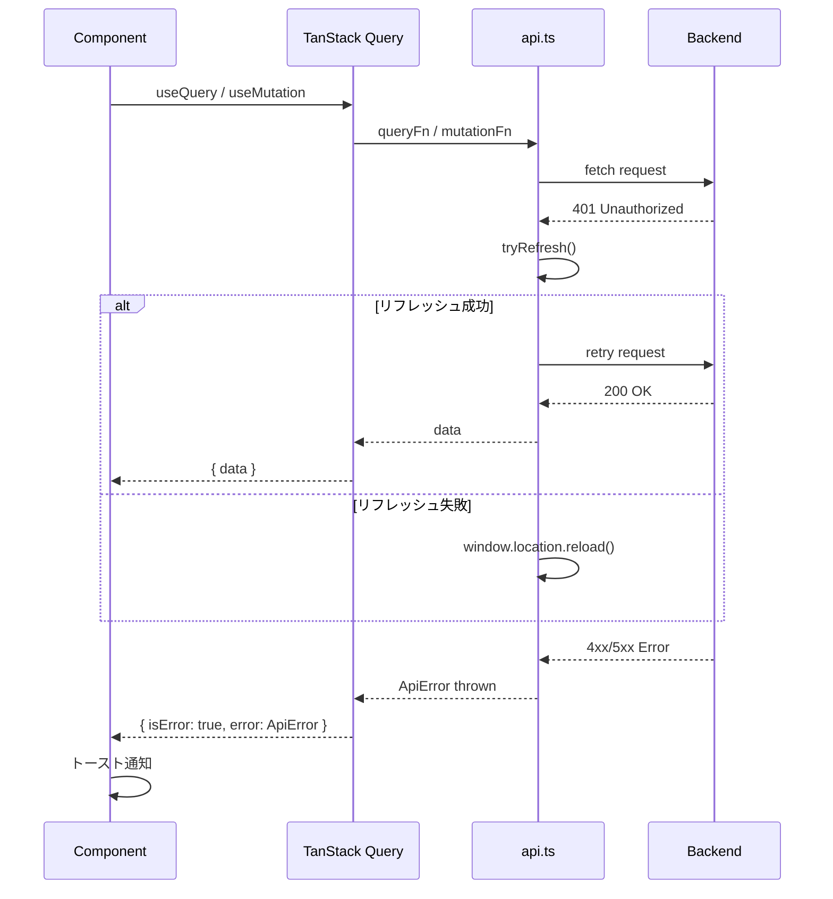
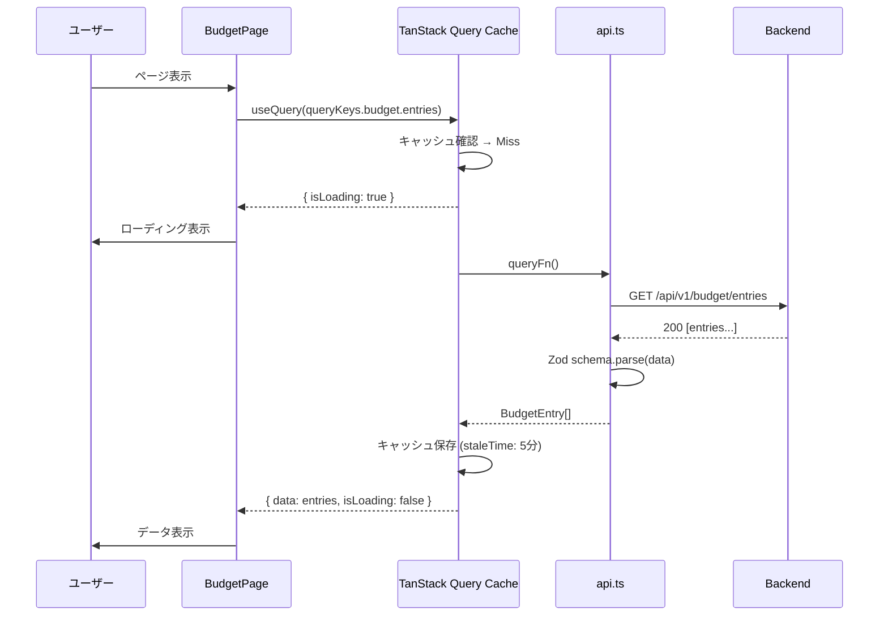
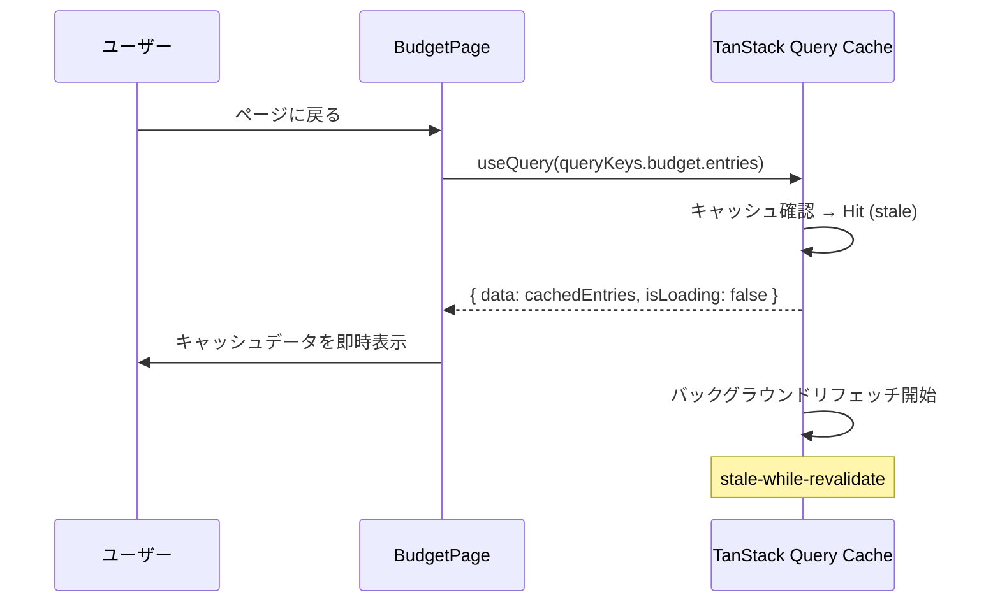
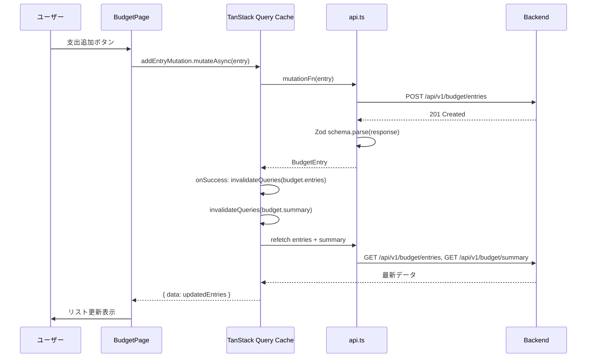

# tanstack-query - 設計書

**基準文書**: `specs/features/17-tanstack-query/requirements.md`
**作成日**: 2026-03-16
**図ガイドライン**: [diagram-guidelines.md](./diagram-guidelines.md)

---

## 1. 概要

**目的**: TanStack Query v5 + Zod を全フロントエンドに導入し、12個のカスタムフックを移行することで、キャッシュ・ランタイム型安全性・ボイラープレート削減を実現する。バックエンドは変更しない。

**スコープ**:
- TanStack Query v5 + Zod のパッケージ追加
- `QueryClientProvider` をアプリルートに配置
- Zod スキーマ定義（全 API レスポンス型）
- `api.ts` への Zod パース統合ヘルパー追加
- 全カスタムフック（12個）の TanStack Query 移行
- QueryKey の体系的な設計
- バックグラウンドジョブポーリングの `refetchInterval` 移行

---

## 2. アーキテクチャ（C4 Model）

### 2.1 Context（Level 1）- システム境界

フロントエンドのみの変更。バックエンド（Rust/Axum）への変更なし。



**外部連携**:
| 外部システム | 連携方式 | 目的 |
|--------------|----------|------|
| homie-backend | REST API (fetch) | 全データ取得・更新 |
| Google Calendar API | REST API (バックエンド経由) | カレンダー同期 |

---

### 2.2 Container（Level 2）- コンテナ構成



プロバイダー階層（変更後）:
```
StrictMode
  → QueryClientProvider    ← 追加（最外殻）
    → App
      → AuthContext.Provider
        → ToastProvider
          → BackgroundJobsProvider（リファクタリング対象）
            → BrowserRouter
              → Routes
```

| コンテナ | 技術 | 責務 |
|----------|------|------|
| QueryClientProvider | TanStack Query v5 | キャッシュ管理・クエリ状態管理 |
| Feature Hooks | TanStack Query useQuery/useMutation | 各機能のデータアクセス |
| api.ts | fetch + Zod | HTTP リクエスト + レスポンスバリデーション |
| src/lib/schemas/ | Zod | 全 API レスポンス型のスキーマ定義 |

---

### 2.3 Component（Level 3）- コンポーネント設計

**レイヤー構造**:



| レイヤー | ファイル | 責務 |
|----------|----------|------|
| Presentation | `src/features/*/` コンポーネント | UI表示・ユーザー操作 |
| Hooks | `src/features/*/use*.ts` | TanStack Query useQuery/useMutation |
| QueryKeys | `src/lib/queryKeys.ts` | QueryKey の一元管理 |
| API Client | `src/utils/api.ts` | fetch + 401リフレッシュ + Zod パース |
| Schema | `src/lib/schemas/*.ts` | Zod スキーマ + 型エクスポート |

---

### 2.4 データモデル（Zod スキーマ構成）

バックエンド DB スキーマは変更なし。フロントエンドの型定義を Zod スキーマから導出する形式に移行する。



---

## 3. 詳細設計

### 3.1 QueryClient 設定

**ファイル**: `src/lib/queryClient.ts`

```typescript
import { QueryClient } from '@tanstack/react-query';

export const queryClient = new QueryClient({
  defaultOptions: {
    queries: {
      staleTime: 1000 * 60 * 5,      // 5分: デフォルト staleTime
      gcTime: 1000 * 60 * 10,         // 10分: 未使用キャッシュ保持
      retry: (failureCount, error) => {
        // 401/403/404 はリトライしない
        if (error instanceof ApiError && [401, 403, 404].includes(error.status)) {
          return false;
        }
        return failureCount < 2;
      },
      refetchOnWindowFocus: true,
    },
    mutations: {
      retry: false,
    },
  },
});
```

**feature 別 staleTime 指針**:

| Feature | staleTime | 理由 |
|---------|-----------|------|
| budget/entries | 5分 | 更新頻度低め |
| budget/summary | 5分 | entries と連動 |
| garbage | 10分 | ほぼ静的データ |
| calendar | 3分 | 変更が頻繁 |
| accounts | 5分 | 残高は重要だが高頻度でない |
| subscriptions | 10分 | ほぼ静的 |
| monthly-budgets | 5分 | 月次設定 |
| savings | 5分 | 変動少ない |
| employment/shifts/salary | 5分 | 月次変動 |
| documents | 10分 | ほぼ静的 |
| auth/me | 10分 | セッション有効期間に依存 |
| jobs/{id} (polling) | 0 | リアルタイム性必須 |
| notifications | 10分 | 設定変更は稀 |

---

### 3.2 QueryKey 設計

**ファイル**: `src/lib/queryKeys.ts`

QueryKey は `['feature', 'resource', ...params]` 形式で統一する。

```typescript
export const queryKeys = {
  // Budget
  budget: {
    all: ['budget'] as const,
    entries: (yearMonth?: string) =>
      ['budget', 'entries', yearMonth ?? 'current'] as const,
    summary: (yearMonth?: string) =>
      ['budget', 'summary', yearMonth ?? 'current'] as const,
  },

  // Subscriptions
  subscriptions: {
    all: ['subscriptions'] as const,
    list: () => ['subscriptions', 'list'] as const,
  },

  // Garbage
  garbage: {
    all: ['garbage'] as const,
    categories: () => ['garbage', 'categories'] as const,
    schedules: () => ['garbage', 'schedules'] as const,
  },

  // Calendar
  calendar: {
    all: ['calendar'] as const,
    events: (start?: string, end?: string) =>
      ['calendar', 'events', start, end] as const,
    googleStatus: () => ['calendar', 'google', 'status'] as const,
    googleCalendars: () => ['calendar', 'google', 'calendars'] as const,
  },

  // Auth
  auth: {
    me: () => ['auth', 'me'] as const,
  },

  // Accounts
  accounts: {
    all: ['accounts'] as const,
    list: () => ['accounts', 'list'] as const,
    transactions: (accountId: string, yearMonth?: string) =>
      ['accounts', 'transactions', accountId, yearMonth ?? 'all'] as const,
  },

  // Monthly Budgets
  monthlyBudgets: {
    all: ['monthly-budgets'] as const,
    list: (yearMonth?: string) =>
      ['monthly-budgets', 'list', yearMonth ?? 'all'] as const,
  },

  // Savings
  savings: {
    all: ['savings'] as const,
    list: () => ['savings', 'list'] as const,
  },

  // Employment / Shifts / Salary
  employment: {
    all: ['employment'] as const,
    list: () => ['employment', 'list'] as const,
    shifts: (yearMonth?: string, userId?: string) =>
      ['employment', 'shifts', yearMonth ?? 'all', userId ?? 'all'] as const,
    salary: (yearMonth?: string) =>
      ['employment', 'salary', yearMonth ?? 'all'] as const,
    salaryPredict: (yearMonth?: string) =>
      ['employment', 'salary', 'predict', yearMonth ?? 'current'] as const,
  },

  // Documents
  documents: {
    all: ['documents'] as const,
    list: () => ['documents', 'list'] as const,
  },

  // Notifications
  notifications: {
    preferences: () => ['notifications', 'preferences'] as const,
  },

  // Background Jobs
  jobs: {
    detail: (jobId: string) => ['jobs', jobId] as const,
  },
} as const;
```

---

### 3.3 api.ts 拡張（Zod パース統合）

**ファイル**: `src/utils/api.ts` に追加

```typescript
import type { ZodSchema } from 'zod';

export const api = {
  // 既存メソッドを維持
  get: <T>(path: string) => request<T>(path),
  post: <T>(path: string, body?: unknown) => ...,
  put: <T>(path: string, body: unknown) => ...,
  patch: <T>(path: string, body?: unknown) => ...,
  delete: (path: string) => request<void>(path, { method: 'DELETE' }),

  // 追加: Zod パース統合ヘルパー
  getWithSchema: async <T>(path: string, schema: ZodSchema<T>): Promise<T> => {
    const raw = await request<unknown>(path);
    return schema.parse(raw);
  },
  postWithSchema: async <T>(path: string, schema: ZodSchema<T>, body?: unknown): Promise<T> => {
    const raw = await request<unknown>(path, {
      method: 'POST',
      body: body ? JSON.stringify(body) : undefined,
    });
    return schema.parse(raw);
  },
  putWithSchema: async <T>(path: string, schema: ZodSchema<T>, body: unknown): Promise<T> => {
    const raw = await request<unknown>(path, {
      method: 'PUT',
      body: JSON.stringify(body),
    });
    return schema.parse(raw);
  },
};
```

**方針**: 既存の `api.get/post/put/patch/delete` は互換性のため残す。新規フックは `*WithSchema` を使用する。移行中の混在は許容する。

---

### 3.4 Zod スキーマ定義

**ディレクトリ**: `src/lib/schemas/`

各スキーマファイルの構成パターン（budget.ts を例示）:

```typescript
// src/lib/schemas/budget.ts
import { z } from 'zod';

export const BudgetEntrySchema = z.object({
  id: z.string(),
  homeId: z.string(),
  date: z.string(),
  amount: z.number(),
  category: z.string(),
  description: z.string(),
  paidBy: z.string(),
  receiptImageUrl: z.string().optional(),
  accountId: z.string().optional(),
});

export const BudgetSummarySchema = z.object({
  monthlyTotal: z.number(),
  byPerson: z.record(z.string(), z.number()),
  byCategory: z.record(z.string(), z.number()),
});

export const BudgetEntryListSchema = z.array(BudgetEntrySchema);

// 型エクスポート（既存 interface と同等）
export type BudgetEntry = z.infer<typeof BudgetEntrySchema>;
export type BudgetSummary = z.infer<typeof BudgetSummarySchema>;
```

**全スキーマファイル一覧**:

| ファイル | スキーマ定義 |
|----------|-------------|
| `budget.ts` | BudgetEntrySchema, BudgetSummarySchema |
| `subscriptions.ts` | SubscriptionSchema |
| `garbage.ts` | GarbageCategorySchema, GarbageScheduleSchema |
| `calendar.ts` | CalendarEventSchema |
| `accounts.ts` | AccountSchema, AccountWithBalanceSchema, AccountTransactionSchema, AccountsSummarySchema |
| `monthly-budgets.ts` | MonthlyBudgetSchema, BudgetVsActualSchema |
| `savings.ts` | SavingsGoalSchema, SavingsGoalWithProgressSchema |
| `employment.ts` | EmploymentSchema, ShiftSchema, SalaryRecordSchema, SalaryPredictionSchema, ShiftPayDetailSchema |
| `documents.ts` | DocumentSchema |
| `auth.ts` | UserSchema |
| `jobs.ts` | BackgroundJobSchema |
| `notifications.ts` | NotificationPreferencesSchema |
| `google-calendar.ts` | GoogleCalendarStatusSchema, GoogleCalendarInfoSchema, SyncResultSchema |

---

### 3.5 フック移行パターン

#### パターン A: 単純 Query（例: useSubscriptions）

**移行前**:
```typescript
const [subscriptions, setSubscriptions] = useState<Subscription[]>([]);
const [loading, setLoading] = useState(true);

useEffect(() => {
  setLoading(true);
  api.get<Subscription[]>('/api/v1/subscriptions')
    .then(setSubscriptions)
    .finally(() => setLoading(false));
}, []);
```

**移行後**:
```typescript
export function useSubscriptions() {
  const { data, isLoading } = useQuery({
    queryKey: queryKeys.subscriptions.list(),
    queryFn: () => api.getWithSchema('/api/v1/subscriptions', SubscriptionListSchema),
    staleTime: 1000 * 60 * 10,
  });

  return {
    subscriptions: data ?? [],
    loading: isLoading,
    monthlyTotal: useMemo(
      () => (data ?? []).reduce((sum, s) => sum + s.amount, 0),
      [data]
    ),
  };
}
```

#### パターン B: パラメータ付き Query（例: useBudget）

yearMonth パラメータが変わると自動的に別キャッシュが使われる:

```typescript
export function useBudget(yearMonth?: string) {
  const queryClient = useQueryClient();
  const params = yearMonth ? `?year_month=${yearMonth}` : '';

  const entriesQuery = useQuery({
    queryKey: queryKeys.budget.entries(yearMonth),
    queryFn: () => api.getWithSchema(
      `/api/v1/budget/entries${params}`,
      BudgetEntryListSchema
    ),
  });

  const summaryQuery = useQuery({
    queryKey: queryKeys.budget.summary(yearMonth),
    queryFn: () => api.getWithSchema(
      `/api/v1/budget/summary${params}`,
      BudgetSummarySchema
    ),
  });

  const addEntryMutation = useMutation({
    mutationFn: (entry: NewBudgetEntry) =>
      api.postWithSchema('/api/v1/budget/entries', BudgetEntrySchema, entry),
    onSuccess: () => {
      queryClient.invalidateQueries({ queryKey: queryKeys.budget.entries(yearMonth) });
      queryClient.invalidateQueries({ queryKey: queryKeys.budget.summary(yearMonth) });
    },
  });

  return {
    entries: entriesQuery.data ?? [],
    loading: entriesQuery.isLoading || summaryQuery.isLoading,
    addEntry: addEntryMutation.mutateAsync,
    updateEntry: updateEntryMutation.mutateAsync,
    deleteEntry: deleteEntryMutation.mutateAsync,
    monthlyTotal: summaryQuery.data?.monthlyTotal ?? 0,
    monthlyByPerson: summaryQuery.data?.byPerson ?? {},
    categorySummary: summaryQuery.data?.byCategory ?? {},
  };
}
```

#### パターン C: Mutation + Invalidation

```typescript
const deleteMutation = useMutation({
  mutationFn: (id: string) => api.delete(`/api/v1/budget/entries/${id}`),
  onSuccess: () => {
    // 関連キャッシュを一括 invalidate
    queryClient.invalidateQueries({ queryKey: queryKeys.budget.all });
  },
  onError: (error) => {
    // エラーは useMutation の isError/error から取得可能
    // コンポーネント側で toast 通知
  },
});
```

#### パターン D: バックグラウンドジョブポーリング

BackgroundJobsProvider は既存の Context ベース設計を維持し、内部のポーリングを TanStack Query の `refetchInterval` に移行する:

```typescript
// BackgroundJobsProvider 内部の useQuery によるポーリング
function JobPoller({ jobId, onComplete, onError }: JobPollerProps) {
  const { data } = useQuery({
    queryKey: queryKeys.jobs.detail(jobId),
    queryFn: () => api.getWithSchema(`/api/v1/jobs/${jobId}`, BackgroundJobSchema),
    refetchInterval: (query) => {
      const status = query.state.data?.status;
      if (status === 'completed' || status === 'failed') return false;
      return 3000; // 3秒ポーリング
    },
    staleTime: 0,
  });

  useEffect(() => {
    if (data?.status === 'completed') onComplete(data);
    if (data?.status === 'failed') onError(data);
  }, [data?.status]);

  return null;
}

// Provider は Context ベースを維持
export function BackgroundJobsProvider({ children }) {
  const [activeJobs, setActiveJobs] = useState<Map<string, string>>(new Map());
  // ...
  return (
    <BackgroundJobsContext.Provider value={...}>
      {Array.from(activeJobs.entries()).map(([jobId, jobType]) => (
        <JobPoller
          key={jobId}
          jobId={jobId}
          onComplete={handleComplete}
          onError={handleError}
        />
      ))}
      {children}
    </BackgroundJobsContext.Provider>
  );
}
```

#### パターン E: useAuth（Context 維持 + API 部分のみ移行）

useAuth は Context ベースを維持。内部の `/api/v1/auth/me` 取得のみ useQuery 化:

```typescript
export function useAuthProvider() {
  const { data: user, isLoading: loading, refetch: refetchMe } = useQuery({
    queryKey: queryKeys.auth.me(),
    queryFn: () => api.getWithSchema('/api/v1/auth/me', UserSchema),
    staleTime: 1000 * 60 * 10,
    retry: (_, error) =>
      !(error instanceof ApiError && error.status === 401),
  });

  const login = useCallback(async (email, password) => {
    await api.post('/api/v1/auth/login', { email, password });
    queryClient.invalidateQueries({ queryKey: queryKeys.auth.me() });
  }, []);

  const logout = useCallback(async () => {
    await api.post('/api/v1/auth/logout');
    queryClient.clear(); // 全キャッシュクリア
  }, []);

  return { user: user ?? null, loading, login, logout, refetchMe };
}
```

**ポイント**: ログアウト時に `queryClient.clear()` で全キャッシュをクリアし、別ユーザーのデータが残らないようにする。

---

### 3.6 既存インターフェースとの互換性

各フックの返り値インターフェースは原則として変更しない。主な互換対応:

| 既存 | TanStack Query | 互換対応 |
|------|----------------|----------|
| `loading: boolean` | `isLoading: boolean` | 返り値で `loading: isLoading` とリネーム |
| `refetch()` | `refetch()` | そのまま expose |
| `await addEntry()` | `addEntryMutation.mutateAsync()` | `addEntry: addEntryMutation.mutateAsync` |
| state を直接更新 | キャッシュ invalidation | `onSuccess` で invalidate |

**コンポーネント側変更が必要なケース**:
- `error` フィールドを返していなかったフックに `error` を追加 → コンポーネント側は既存コードに影響なし（追加のみ）

---

## 4. API 仕様

バックエンド変更なし。フロントエンドから呼び出す既存 API エンドポイントの一覧（参照用）。

| メソッド | パス | 用途 | フック |
|----------|------|------|--------|
| GET | /api/v1/budget/entries | 支出一覧 | useBudget |
| GET | /api/v1/budget/summary | 支出サマリー | useBudget |
| POST | /api/v1/budget/entries | 支出追加 | useBudget |
| PUT | /api/v1/budget/entries/:id | 支出更新 | useBudget |
| DELETE | /api/v1/budget/entries/:id | 支出削除 | useBudget |
| GET/POST/PUT/DELETE | /api/v1/subscriptions | 定期支出CRUD | useSubscriptions |
| GET/POST/PUT/DELETE | /api/v1/garbage/categories | ゴミ分類CRUD | useGarbage |
| GET/POST/PUT/DELETE | /api/v1/garbage/schedules | ゴミ収集スケジュールCRUD | useGarbage |
| GET/POST/PUT/DELETE | /api/v1/calendar/events | カレンダーイベントCRUD | useCalendar |
| PATCH | /api/v1/calendar/events/:id/toggle | タスク完了トグル | useCalendar |
| GET | /api/v1/auth/me | ログインユーザー取得 | useAuth |
| GET/POST/PUT/DELETE | /api/v1/accounts | 口座CRUD | useAccounts |
| GET/POST/DELETE | /api/v1/accounts/:id/transactions | 取引CRUD | useAccountTransactions |
| GET/POST/DELETE | /api/v1/budgets/monthly | 月次予算CRUD | useMonthlyBudgets |
| GET/POST/PUT/DELETE | /api/v1/savings | 貯蓄目標CRUD | useSavings |
| GET/POST/PUT/DELETE | /api/v1/employments | 雇用CRUD | useEmployments |
| GET/POST/PUT/DELETE | /api/v1/shifts | シフトCRUD | useShifts |
| GET/POST/PUT/DELETE | /api/v1/salary/records | 給与記録CRUD | useSalary |
| GET | /api/v1/salary/predict | 給与予測 | useSalary |
| GET/POST/PUT/DELETE | /api/v1/documents | 書類CRUD | useDocuments |
| GET | /api/v1/push/preferences | 通知設定取得 | useNotificationSettings |
| PUT | /api/v1/push/preferences | 通知設定更新 | useNotificationSettings |
| GET | /api/v1/jobs/:id | ジョブ状態取得 | BackgroundJobsProvider |
| GET | /api/v1/calendar/google/status | Google連携状態 | useGoogleCalendar |
| GET | /api/v1/calendar/google/calendars | Googleカレンダー一覧 | useGoogleCalendar |

---

## 5. セキュリティ設計

### 5.1 認証・認可

| 項目 | 設計 |
|------|------|
| 認証方式 | JWT (HttpOnly Cookie) — 既存設計を維持 |
| 認可方式 | バックエンド側で homeId ベースの認可 — 変更なし |
| セッション管理 | 401 時に `api.ts` が自動リフレッシュ、失敗時 window.location.reload() |
| ログアウト時 | `queryClient.clear()` で全キャッシュをクリア（他ユーザーのデータ混入防止） |

### 5.2 データ保護

| 項目 | 対応 |
|------|------|
| 転送中の暗号化 | TLS（既存） |
| credentials | `credentials: 'include'`（HttpOnly Cookie）を維持 |
| キャッシュ内の機密データ | メモリ内のみ（localStorage/sessionStorage は使用しない） |

### 5.3 入力検証（Zod によるランタイムバリデーション）

| 対象 | 検証方法 |
|------|----------|
| API レスポンス | Zod `schema.parse(raw)` による厳格パース |
| パース失敗時 | ZodError をスロー → TanStack Query の `error` 状態に格納 |
| ユーザー入力 | コンポーネント/フォーム側で既存バリデーション維持（スコープ外） |

**Zod パースエラーの伝播**:
- `getWithSchema` 内で `schema.parse()` が失敗 → `ZodError` をスロー
- TanStack Query がキャッチ → `isError: true`, `error: ZodError` として格納
- コンポーネントは `isError` を確認してエラー表示

### 5.4 監査ログ

| イベント | ログ内容 |
|----------|----------|
| Zod パースエラー | 開発環境のみコンソール出力（本番は将来的に監視ツール連携） |
| 認証失敗 (401) | バックエンド側で記録（変更なし） |

---

## 6. エラーハンドリング設計

### 6.1 異常系フロー



### 6.2 リトライ戦略

| エラー種別 | リトライ | 理由 |
|------------|----------|------|
| 401 Unauthorized | リトライなし（リフレッシュは api.ts 内で処理） | |
| 403 Forbidden | リトライなし | アクセス権限の問題 |
| 404 Not Found | リトライなし | リソース不在 |
| 5xx Server Error | 最大2回、指数バックオフ | 一時的障害への対応 |
| ネットワークエラー | 最大2回 | 一時的な接続断 |
| ZodError | リトライなし | データ形式問題はリトライで解決しない |

### 6.3 ユーザーへのエラー表示

| 場面 | 表示方法 |
|------|----------|
| Query エラー | コンポーネントの `isError` チェック + エラーメッセージ表示 |
| Mutation エラー | `onError` callback または `isError` チェック + toast 通知 |
| 認証切れ | window.location.reload()（既存動作維持） |

**エラー通知パターン（コンポーネント側）**:
```typescript
const addMutation = useMutation({
  mutationFn: ...,
  onError: (error) => {
    const message = error instanceof ApiError
      ? error.message
      : '予期しないエラーが発生しました';
    toast(message, 'error');
  },
});
```

### 6.4 フォールバック方針

| 状況 | フォールバック |
|------|---------------|
| Query エラー時 | `data ?? []` / `data ?? null` のデフォルト値を返す |
| stale データあり | stale データを表示しつつバックグラウンドリフェッチ |
| 全キャッシュクリア | ログアウト時のみ実行 |

---

## 7. シーケンス図

### 7.1 初回データ取得（キャッシュミス）



### 7.2 画面遷移後の再表示（キャッシュヒット）



### 7.3 Mutation + Invalidation



---

## 8. 設計決定（Type 1/Type 2）

### Type 1 決定（不可逆 - ADR 必須）

| 決定事項 | 選択 | 理由 | ADR |
|----------|------|------|-----|
| サーバー状態管理ライブラリの採用 | TanStack Query v5 | キャッシュ・リトライ・DevTools・React 19 対応 | [ADR-001](./adr.md) |

### Type 2 決定（可逆 - 変更容易）

| 決定事項 | 選択 | 理由 |
|----------|------|------|
| QueryClient を singleton export | `src/lib/queryClient.ts` で export | Provider 外からのキャッシュ操作（logout 等）に必要 |
| Zod strict vs. passthrough | `z.object()` (strict) | 未知フィールドを除外し型安全性を高める |
| BackgroundJobsProvider の設計 | Context ベース維持 + 内部 JobPoller コンポーネント | Provider の外部 API を変えず内部実装のみ変更 |
| useAuth は Context ベース維持 | API コール部分のみ useQuery 化 | 全コンポーネントが useAuth() を使用しており外部 API 変更はリスク大 |
| staleTime のデフォルト | 5分 | UX と API 負荷のバランス。feature 別に上書き可能 |
| 既存 `api.get/post` メソッドを残す | 互換維持のため削除しない | 移行中の混在許容。移行完了後に削除検討 |
| QueryKey は `const` 型で定義 | `as const` を使用 | TypeScript の型推論でキー名のタイポを防ぐ |

---

## 9. テスト戦略

既存のテストファイルはなし。今回の移行スコープにテスト追加は含まない（NFR-DX として将来対応）。

### 9.1 テスト可能性の考慮

TanStack Query 移行によりテスタビリティが向上する:

| レイヤー | テスト方法 | モック対象 |
|----------|------------|------------|
| Custom Hooks | `@testing-library/react` + `renderHook` | `api.ts` の fetch |
| Components | `@testing-library/react` | `QueryClientProvider` でラップ |
| Zod Schemas | Unit Test | なし（純粋関数） |

### 9.2 テストケース概要（将来実装）

| 観点 | テスト内容 |
|------|------------|
| 正常系 | useQuery がデータを返すこと、useMutation 後に invalidation が走ること |
| 異常系 | ApiError 時に isError が true になること、ZodError がキャッチされること |
| キャッシュ | staleTime 内に同一キーのクエリが発火しないこと |

---

## 10. 実装戦略

### 10.1 ファイル構成

```
homie-app/src/
├── lib/
│   ├── queryClient.ts          # QueryClient インスタンス + デフォルト設定
│   ├── queryKeys.ts            # QueryKey 一元管理
│   └── schemas/
│       ├── index.ts            # 全スキーマ re-export
│       ├── budget.ts
│       ├── subscriptions.ts
│       ├── garbage.ts
│       ├── calendar.ts
│       ├── google-calendar.ts
│       ├── accounts.ts
│       ├── monthly-budgets.ts
│       ├── savings.ts
│       ├── employment.ts
│       ├── documents.ts
│       ├── auth.ts
│       ├── jobs.ts
│       └── notifications.ts
├── utils/
│   └── api.ts                  # 既存 + getWithSchema/postWithSchema/putWithSchema 追加
├── main.tsx                    # 変更なし
├── App.tsx                     # QueryClientProvider を追加
└── features/
    ├── budget/
    │   └── useBudget.ts        # TanStack Query 移行
    ├── budget/
    │   └── useSubscriptions.ts
    ├── garbage/
    │   └── useGarbage.ts
    ├── calendar/
    │   ├── useCalendar.ts
    │   └── google/
    │       └── useGoogleCalendar.ts
    ├── auth/
    │   └── useAuth.ts          # useQuery 部分移行、Context 維持
    ├── accounts/
    │   └── useAccounts.ts
    ├── monthly-budgets/
    │   └── useMonthlyBudgets.ts
    ├── savings/
    │   └── useSavings.ts
    ├── employment/
    │   └── useEmployment.ts
    ├── documents/
    │   └── useDocuments.ts
    ├── settings/
    │   └── useNotificationSettings.ts
    └── hooks/
        └── BackgroundJobsProvider.tsx  # JobPoller 内部コンポーネント追加
```

### 10.2 依存関係

| ライブラリ | バージョン | 用途 |
|------------|------------|------|
| @tanstack/react-query | ^5.x | サーバー状態管理 |
| @tanstack/react-query-devtools | ^5.x | 開発時デバッグ（devDependencies） |
| zod | 4.3.6 (インストール済み) | ランタイム型バリデーション |

### 10.3 実装順序

1. **Phase 1 - 基盤**: `queryClient.ts`, `queryKeys.ts`, `api.ts` 拡張
2. **Phase 2 - スキーマ**: `src/lib/schemas/` の全スキーマ定義
3. **Phase 3 - Provider**: `App.tsx` に `QueryClientProvider` 追加
4. **Phase 4 - フック移行**: 単純なフックから順番に移行
   - useSavings → useSubscriptions → useDocuments → useAccounts
   - useGarbage → useMonthlyBudgets → useEmployments
   - useBudget → useCalendar → useShifts → useSalary
5. **Phase 5 - 複雑なフック**: useAuth, BackgroundJobsProvider の移行
6. **Phase 6 - DevTools**: 開発環境への DevTools 追加、動作確認

### 10.4 App.tsx 変更点

```typescript
import { QueryClientProvider } from '@tanstack/react-query';
import { ReactQueryDevtools } from '@tanstack/react-query-devtools';
import { queryClient } from '@/lib/queryClient';

// QueryClientProvider を最外殻に追加
export default function App() {
  return (
    <QueryClientProvider client={queryClient}>
      {/* 既存のコンテンツ */}
      <AuthContext.Provider value={auth}>
        <ToastProvider>
          <BackgroundJobsProvider>
            <BrowserRouter>
              <Routes>...</Routes>
            </BrowserRouter>
          </BackgroundJobsProvider>
        </ToastProvider>
      </AuthContext.Provider>
      {import.meta.env.DEV && <ReactQueryDevtools />}
    </QueryClientProvider>
  );
}
```

---

## 11. 関連ドキュメント

- [requirements.md](./requirements.md) - 要件定義書
- [hearing.md](./hearing.md) - 要件ヒアリング
- [adr.md](./adr.md) - 設計決定記録（TanStack Query 採用）
- [arch-check.md](./arch-check.md) - アーキテクチャチェック
- [tasks.md](./tasks.md) - タスク一覧
