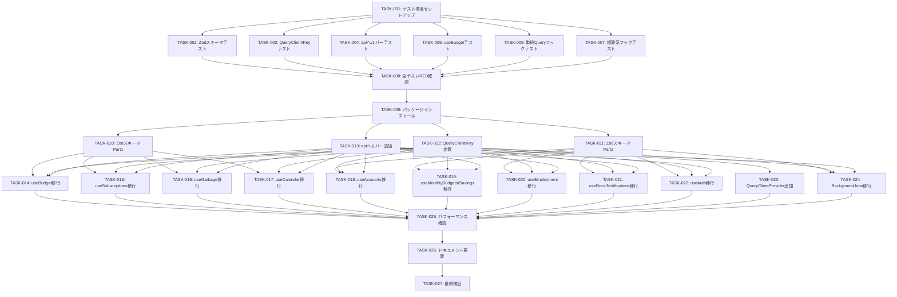

# タスク一覧: tanstack-query

**Issue**: #17
**更新日**: 2026-03-16
**ステータス**: Draft

---

## タスク分解方式

### 方式B: Layer-by-Layer（既存パターンが確立している場合）
> Domain → Service → Handler と段階的に実装

TanStack Query + Zod はフロントエンド既存パターン（カスタムフック）の置き換えであり、アーキテクチャの不確実性は低い（ADR-001 で技術選定済み）。Walking Skeleton は不要。

---

## Phase 1: テストコード作成 / Test First (TDD: RED)

- [ ] **TASK-17-001**: Vitest + React Testing Library + MSW のセットアップ（S）
  - 目的: テスト実行環境を構築する
  - 含める: `pnpm add -D vitest @testing-library/react @testing-library/jest-dom happy-dom msw`, `vitest.config.ts` 作成, テストヘルパー (QueryClient ラッパー) 作成, MSW サーバーセットアップ (`src/test/setup.ts`, `src/test/server.ts`)
  - 含めない: テストケース本体
  - _Requirements: 全体_
  - _依存: なし_
  - _コミット: `feat:17_Phase1_テスト環境セットアップ`_

- [ ] **TASK-17-002**: Zod スキーマのテストコード作成（M）
  - 目的: 全 Zod スキーマの正常系・異常系・境界値テストを作成する
  - 含める: `src/lib/schemas/__tests__/*.test.ts` (13ファイル) — TC-008 ~ TC-027, TC-075 ~ TC-086
  - 含めない: スキーマ実装本体
  - _Requirements: ACC-17-003, ACC-17-004_
  - _依存: TASK-17-001_
  - _コミット: `feat:17_Phase1_Zodスキーマテスト作成`_

- [ ] **TASK-17-003**: QueryClient + QueryKey のテストコード作成（S）
  - 目的: QueryClient 設定と QueryKey 生成のテストを作成する
  - 含める: `src/lib/__tests__/queryClient.test.ts` (TC-001 ~ TC-006), `src/lib/__tests__/queryKeys.test.ts` (TC-065 ~ TC-070)
  - 含めない: queryClient.ts, queryKeys.ts 実装本体
  - _Requirements: ACC-17-001_
  - _依存: TASK-17-001_
  - _コミット: `feat:17_Phase1_QueryClient_QueryKeyテスト作成`_

- [ ] **TASK-17-004**: api.ts 拡張のテストコード作成（S）
  - 目的: getWithSchema / postWithSchema / putWithSchema のテストを作成する
  - 含める: `src/utils/__tests__/api.test.ts` (TC-061 ~ TC-064)
  - 含めない: api.ts の実装変更
  - _Requirements: ACC-17-003_
  - _依存: TASK-17-001_
  - _コミット: `feat:17_Phase1_apiヘルパーテスト作成`_

- [ ] **TASK-17-005**: useBudget フックのテストコード作成（M）
  - 目的: useBudget の Query / Mutation / キャッシュ Invalidation テストを作成する
  - 含める: `src/features/budget/__tests__/useBudget.test.ts` (TC-029 ~ TC-041, TC-071, TC-074)
  - 含めない: useBudget 実装の書き換え
  - _Requirements: ACC-17-005 ~ ACC-17-009_
  - _依存: TASK-17-001_
  - _コミット: `feat:17_Phase1_useBudgetテスト作成`_

- [ ] **TASK-17-006**: 各フックのテストコード作成 (Part 1: 単純 Query 系)（M）
  - 目的: 単純な Query パターンのフックテストを作成する
  - 含める: useSubscriptions (TC-045, TC-087, TC-088), useGarbage (TC-046, TC-089), useSavings (TC-050, TC-093), useDocuments (TC-054, TC-094), useMonthlyBudgets (TC-049), useNotificationSettings (TC-055, TC-095) の各テストファイル
  - 含めない: フック実装の書き換え
  - _Requirements: ACC-17-011_
  - _依存: TASK-17-001_
  - _コミット: `feat:17_Phase1_単純Queryフックテスト作成`_

- [ ] **TASK-17-007**: 各フックのテストコード作成 (Part 2: 複雑系)（M）
  - 目的: パラメータ付き Query、Auth、Calendar、BackgroundJobs のテストを作成する
  - 含める: useCalendar (TC-047, TC-090, TC-091), useGoogleCalendar (TC-056), useAuth (TC-057 ~ TC-060), useAccounts (TC-048, TC-092), useEmployment (TC-051 ~ TC-053), BackgroundJobsProvider (TC-042 ~ TC-044), App DevTools (TC-007) の各テストファイル
  - 含めない: フック実装の書き換え
  - _Requirements: ACC-17-010, ACC-17-011, ACC-17-012_
  - _依存: TASK-17-001_
  - _コミット: `feat:17_Phase1_複雑系フックテスト作成`_

- [ ] **TASK-17-008**: Phase 1 完了確認 - 全テスト FAIL の確認（XS）
  - 目的: 全テストが RED 状態であることを確認する
  - 含める: `pnpm test --run` を実行し、全テストが FAIL することを確認。テスト数のスナップショットを記録
  - 含めない: テスト修正
  - _Requirements: 全体_
  - _依存: TASK-17-002 ~ TASK-17-007_
  - _コミット: `feat:17_Phase1_全テストRED確認`_

---

## Phase 2: ドメイン層 / Domain Layer (TDD: GREEN)

- [ ] **TASK-17-009**: Zod + TanStack Query パッケージインストール（XS）
  - 目的: 必要な npm パッケージをインストールする
  - 含める: `pnpm add @tanstack/react-query zod`, `pnpm add -D @tanstack/react-query-devtools`
  - 含めない: 設定ファイル、コード変更
  - _Requirements: ACC-17-001, ACT-01 (arch-check)_
  - _依存: TASK-17-008_
  - _コミット: `feat:17_Phase2_パッケージインストール`_

- [ ] **TASK-17-010**: Zod スキーマ定義 (Part 1: budget, subscriptions, garbage, calendar)（M）
  - 目的: 4 feature の Zod スキーマを実装し、対応する単体テストを通す
  - 含める: `src/lib/schemas/budget.ts`, `subscriptions.ts`, `garbage.ts`, `calendar.ts`, `google-calendar.ts`, `src/lib/schemas/index.ts` (re-export)
  - 含めない: 他 feature のスキーマ
  - テスト実行: TC-008 ~ TC-014, TC-019, TC-026, TC-075 ~ TC-080, TC-082 が PASS
  - _Requirements: ACC-17-003, ACC-17-004_
  - _依存: TASK-17-009_
  - _並列可能: Yes (TASK-17-011 と並列可)_
  - _コミット: `feat:17_Phase2_Zodスキーマ定義_Part1`_

- [ ] **TASK-17-011**: Zod スキーマ定義 (Part 2: accounts, employment, savings, auth, jobs, documents, monthly-budgets, notifications)（M）
  - 目的: 残り全 feature の Zod スキーマを実装し、対応する単体テストを通す
  - 含める: `src/lib/schemas/accounts.ts`, `employment.ts`, `savings.ts`, `auth.ts`, `jobs.ts`, `documents.ts`, `monthly-budgets.ts`, `notifications.ts`, index.ts 更新
  - 含めない: なし
  - テスト実行: TC-015 ~ TC-018, TC-020 ~ TC-025, TC-027, TC-081, TC-083 ~ TC-086 が PASS
  - _Requirements: ACC-17-003, ACC-17-004_
  - _依存: TASK-17-009_
  - _並列可能: Yes (TASK-17-010 と並列可)_
  - _コミット: `feat:17_Phase2_Zodスキーマ定義_Part2`_

- [ ] **TASK-17-012**: QueryClient 設定 + QueryKey 定義（S）
  - 目的: QueryClient インスタンスと QueryKey 体系を実装する
  - 含める: `src/lib/queryClient.ts` (デフォルト設定、retry ロジック), `src/lib/queryKeys.ts` (全 feature のキー定義)
  - 含めない: Provider の配置、フック実装
  - テスト実行: TC-001 ~ TC-006, TC-065 ~ TC-070 が PASS
  - _Requirements: ACC-17-001_
  - _依存: TASK-17-009_
  - _並列可能: Yes (TASK-17-010, TASK-17-011 と並列可)_
  - _コミット: `feat:17_Phase2_QueryClient_QueryKey定義`_

- [ ] **TASK-17-013**: api.ts に Zod パースヘルパー追加（S）
  - 目的: 既存 api.ts に getWithSchema / postWithSchema / putWithSchema を追加する
  - 含める: `src/utils/api.ts` への3メソッド追加。既存メソッドは変更しない
  - 含めない: 既存メソッドの削除・変更
  - テスト実行: TC-061 ~ TC-064 が PASS
  - _Requirements: ACC-17-003_
  - _依存: TASK-17-009_
  - _並列可能: Yes_
  - _コミット: `feat:17_Phase2_apiヘルパー追加`_

---

## Phase 3: サービス層 / Service Layer (TDD: GREEN)

- [ ] **TASK-17-014**: useBudget の TanStack Query 移行（M）
  - 目的: useBudget を useState/useEffect から useQuery/useMutation に全面書き換え
  - 含める: entries Query (パラメータ付き), summary Query, addEntry/updateEntry/deleteEntry Mutation, invalidation ロジック。パターン B + C 適用
  - 含めない: コンポーネント側の変更
  - テスト実行: TC-029 ~ TC-041, TC-071, TC-074 が PASS
  - テスト修正禁止（仕様バグ発見時のみ許可、理由を test-spec.md に記録）
  - _Requirements: ACC-17-005 ~ ACC-17-009_
  - _依存: TASK-17-010, TASK-17-012, TASK-17-013_
  - _コミット: `feat:17_Phase3_useBudget移行`_

- [ ] **TASK-17-015**: useSubscriptions の TanStack Query 移行（S）
  - 目的: useSubscriptions を TanStack Query ベースに書き換え
  - 含める: list Query, add/update/delete Mutation, monthlyTotal 計算。パターン A + C 適用
  - 含めない: コンポーネント側の変更
  - テスト実行: TC-045, TC-087, TC-088 が PASS
  - テスト修正禁止
  - _Requirements: ACC-17-011_
  - _依存: TASK-17-010, TASK-17-012, TASK-17-013_
  - _並列可能: Yes (TASK-17-014 と並列可)_
  - _コミット: `feat:17_Phase3_useSubscriptions移行`_

- [ ] **TASK-17-016**: useGarbage の TanStack Query 移行（S）
  - 目的: useGarbage を TanStack Query ベースに書き換え
  - 含める: categories Query, schedules Query, CRUD Mutation。パターン A + C 適用
  - 含めない: コンポーネント側の変更
  - テスト実行: TC-046, TC-089 が PASS
  - テスト修正禁止
  - _Requirements: ACC-17-011_
  - _依存: TASK-17-010, TASK-17-012, TASK-17-013_
  - _並列可能: Yes_
  - _コミット: `feat:17_Phase3_useGarbage移行`_

- [ ] **TASK-17-017**: useCalendar + useGoogleCalendar の TanStack Query 移行（M）
  - 目的: カレンダー系フックを TanStack Query に移行
  - 含める: useCalendar (events Query, CRUD Mutation, toggleTask), useGoogleCalendar (status Query, calendars Query)。命令的 fetchEvents を宣言的パターンに変換
  - 含めない: コンポーネント側の変更
  - テスト実行: TC-047, TC-056, TC-090, TC-091 が PASS
  - テスト修正禁止
  - _Requirements: ACC-17-011, ACT-03 (arch-check 推奨)_
  - _依存: TASK-17-010, TASK-17-012, TASK-17-013_
  - _並列可能: Yes_
  - _コミット: `feat:17_Phase3_useCalendar移行`_

- [ ] **TASK-17-018**: useAccounts の TanStack Query 移行（S）
  - 目的: useAccounts を TanStack Query ベースに書き換え
  - 含める: accounts list Query, transactions Query, CRUD Mutation。パターン B + C 適用
  - 含めない: コンポーネント側の変更
  - テスト実行: TC-048, TC-092 が PASS
  - テスト修正禁止
  - _Requirements: ACC-17-011_
  - _依存: TASK-17-011, TASK-17-012, TASK-17-013_
  - _並列可能: Yes_
  - _コミット: `feat:17_Phase3_useAccounts移行`_

- [ ] **TASK-17-019**: useMonthlyBudgets + useSavings の TanStack Query 移行（S）
  - 目的: 月次予算と貯蓄目標フックを移行
  - 含める: useMonthlyBudgets (list Query, CRUD Mutation), useSavings (list Query, CRUD Mutation)。パターン A + C 適用
  - 含めない: コンポーネント側の変更
  - テスト実行: TC-049, TC-050, TC-093 が PASS
  - テスト修正禁止
  - _Requirements: ACC-17-011_
  - _依存: TASK-17-011, TASK-17-012, TASK-17-013_
  - _並列可能: Yes_
  - _コミット: `feat:17_Phase3_useMonthlyBudgets_useSavings移行`_

- [ ] **TASK-17-020**: useEmployment (useEmployments + useShifts + useSalary) の TanStack Query 移行（M）
  - 目的: 雇用関連 3 フックを TanStack Query に移行
  - 含める: useEmployments (list Query, CRUD), useShifts (パラメータ付き Query, CRUD), useSalary (records Query, predict Query, CRUD)。パターン B + C 適用
  - 含めない: コンポーネント側の変更
  - テスト実行: TC-051 ~ TC-053 が PASS
  - テスト修正禁止
  - _Requirements: ACC-17-011_
  - _依存: TASK-17-011, TASK-17-012, TASK-17-013_
  - _並列可能: Yes_
  - _コミット: `feat:17_Phase3_useEmployment移行`_

- [ ] **TASK-17-021**: useDocuments + useNotificationSettings の TanStack Query 移行（S）
  - 目的: ドキュメントと通知設定フックを移行
  - 含める: useDocuments (list Query, CRUD Mutation), useNotificationSettings (preferences Query, update Mutation)。パターン A + C 適用
  - 含めない: コンポーネント側の変更
  - テスト実行: TC-054, TC-055, TC-094, TC-095 が PASS
  - テスト修正禁止
  - _Requirements: ACC-17-011_
  - _依存: TASK-17-011, TASK-17-012, TASK-17-013_
  - _並列可能: Yes_
  - _コミット: `feat:17_Phase3_useDocuments_useNotificationSettings移行`_

---

## Phase 4: ハンドラ層 / Handler Layer (TDD: GREEN)

- [ ] **TASK-17-022**: useAuth の TanStack Query 部分移行（M）
  - 目的: useAuth の /api/v1/auth/me 取得部分を useQuery 化し、Context ベースは維持
  - 含める: useAuthProvider 内の fetchMe を useQuery に置換, login を Google OAuth リダイレクトで維持 (ACT-02 対応), logout に queryClient.clear() 追加, retry 設定 (401 でリトライしない)。パターン E 適用
  - 含めない: AuthContext のインターフェース変更、他コンポーネントの修正
  - テスト実行: TC-057 ~ TC-060 が PASS
  - テスト修正禁止
  - _Requirements: ACC-17-012, ACT-02 (arch-check)_
  - _依存: TASK-17-011, TASK-17-012, TASK-17-013_
  - _コミット: `feat:17_Phase4_useAuth移行`_

- [ ] **TASK-17-023**: App.tsx に QueryClientProvider + DevTools 追加（S）
  - 目的: アプリルートに QueryClientProvider を配置し、DevTools を開発環境のみ有効化
  - 含める: `App.tsx` 修正 (QueryClientProvider を最外殻に追加), `import.meta.env.DEV` 条件で ReactQueryDevtools を配置
  - 含めない: 他のコンポーネント変更
  - テスト実行: TC-007 が PASS
  - テスト修正禁止
  - _Requirements: ACC-17-001, ACC-17-002_
  - _依存: TASK-17-012_
  - _コミット: `feat:17_Phase4_QueryClientProvider追加`_

---

## Phase 5: その他実装 / Other Implementation (TDD: GREEN)

- [ ] **TASK-17-024**: BackgroundJobsProvider の refetchInterval 移行（M）
  - 目的: setInterval ベースのポーリングを TanStack Query の refetchInterval に移行
  - 含める: JobPoller 内部コンポーネント作成, useQuery + refetchInterval, 完了/失敗時の停止ロジック, Context の外部 API は変更しない。パターン D 適用
  - 含めない: Context インターフェースの変更
  - テスト実行: TC-042 ~ TC-044 が PASS
  - テスト修正禁止
  - _Requirements: ACC-17-010_
  - _依存: TASK-17-011, TASK-17-012, TASK-17-013_
  - _コミット: `feat:17_Phase5_BackgroundJobsProviderリファクタリング`_

- [ ] **TASK-17-025**: パフォーマンス確認 + ZodError リトライ抑制確認（S）
  - 目的: arch-check のパフォーマンス指摘に対応するテストが PASS することを確認
  - 含める: TC-071 (staleTime 内リクエスト抑制), TC-073 (ZodError リトライなし) の PASS 確認。NFR-PERF-002 (バンドルサイズ) の手動確認 (`pnpm build` 後のサイズ計測)
  - 含めない: 新規テスト作成
  - テスト実行: TC-071, TC-073 が PASS, TC-072 手動確認
  - _Requirements: NFR-PERF-001, NFR-PERF-002_
  - _依存: TASK-17-014 ~ TASK-17-024_
  - _コミット: `feat:17_Phase5_パフォーマンス確認`_

---

## Phase 6: ドキュメント更新 / Documentation

- [ ] **TASK-17-026**: SSOT ドキュメント更新（S）
  - 目的: 仕様書類を最新の実装に合わせて更新する
  - 含める: design.md パターン E の login 修正 (ACT-02 反映), design.md の Zod インストール状態を修正, useCalendar 移行パターンの追記 (ACT-03 検討結果)
  - 含めない: 新規ドキュメント作成
  - _Requirements: ACT-02, ACT-03_
  - _依存: TASK-17-014 ~ TASK-17-024_
  - _コミット: `feat:17_Phase6_ドキュメント更新`_

---

## Phase 7: 最終検証 / Verification (TDD: REFACTOR)

- [ ] **TASK-17-027**: 全テスト通過 + リファクタリング + 最終確認（M）
  - 目的: 全テスト通過を確認し、コード品質を最終調整する
  - 含める:
    - `pnpm test --run` で全95テストケースの PASS 確認
    - テストカバレッジ確認 (ライン 80%以上, ブランチ 70%以上)
    - `pnpm lint` 通過確認
    - `pnpm build` 成功確認
    - test-spec.md の修正履歴の確認（変更理由が正当か）
    - types/index.ts の Zod 導出型への移行確認
    - 開発サーバー起動 + 手動動作確認（全機能の既存動作が維持されていること）
    - arch-check 推奨アクション ACT-04 (Zod エラーフォールバック), ACT-05 (エラー表示変化) の確認
  - 含めない: 新機能追加
  - _Requirements: 全体, NFR-DX-001_
  - _依存: Phase 1-6 全完了_
  - _コミット: `feat:17_Phase7_最終検証`_

---

## 依存関係 / Dependencies



---

## リスクマーク / Risk Markers

| マーク | 意味 |
|--------|------|
| ⚠️ | Type 1 決定を含む（ADR 必須） |
| 🔴 | 技術的リスク高（Spike 推奨） |
| 🟡 | 外部依存あり |
| 🟢 | 低リスク |

**リスクのあるタスク**:
| タスク | マーク | 理由 |
|--------|--------|------|
| TASK-17-009 | 🟡 | npm パッケージ追加。React 19 との peerDependency 互換性を確認 |
| TASK-17-017 | 🔴 | useCalendar の命令的 -> 宣言的パターン変換が非自明 (ACT-03) |
| TASK-17-022 | 🔴 | useAuth は Context ベース維持 + useQuery 部分移行の複合パターン |
| TASK-17-024 | 🔴 | BackgroundJobsProvider の setInterval -> refetchInterval 移行。外部 API 維持が必要 |

---

## 工数見積 / Effort Estimation

**見積基準**:
| サイズ | 目安 | 複雑度 |
|--------|------|--------|
| XS | ~30分 | 単純な変更 |
| S | ~1時間 | 既存パターン |
| M | ~2時間 | 新規実装 |
| L | ~4時間 | 複雑な実装 |

| Phase | タスク数 | 見積合計 | 備考 |
|:---|:---|:---|:---|
| Phase 1: Test First (RED) | 8 | ~10時間 | S x3 + M x4 + XS x1 |
| Phase 2: Domain Layer | 5 | ~7時間 | XS x1 + S x2 + M x2 |
| Phase 3: Service Layer | 8 | ~11時間 | S x4 + M x4 |
| Phase 4: Handler Layer | 2 | ~3時間 | S x1 + M x1 |
| Phase 5: Other | 2 | ~3時間 | S x1 + M x1 |
| Phase 6: Documentation | 1 | ~1時間 | S x1 |
| Phase 7: Verification | 1 | ~2時間 | M x1 |

**合計見積**: 27タスク、約37時間（5日間相当）

---

## テストコマンド参照 / Test Commands

```bash
# 単体テスト
cd homie-app && pnpm test --run

# テスト (watch mode)
cd homie-app && pnpm test

# カバレッジ
cd homie-app && pnpm test --coverage

# Lint
cd homie-app && pnpm lint

# ビルド
cd homie-app && pnpm build

# 開発サーバー
cd homie-app && pnpm dev
```

---

## 更新履歴 / History

| 日付 | 内容 |
|:---|:---|
| 2026-03-16 | 初版作成 |

---

## 承認 / Approval

**承認する場合:** 「承認」または「OK」と回答してください
**修正が必要な場合:** 修正点を指摘してください
